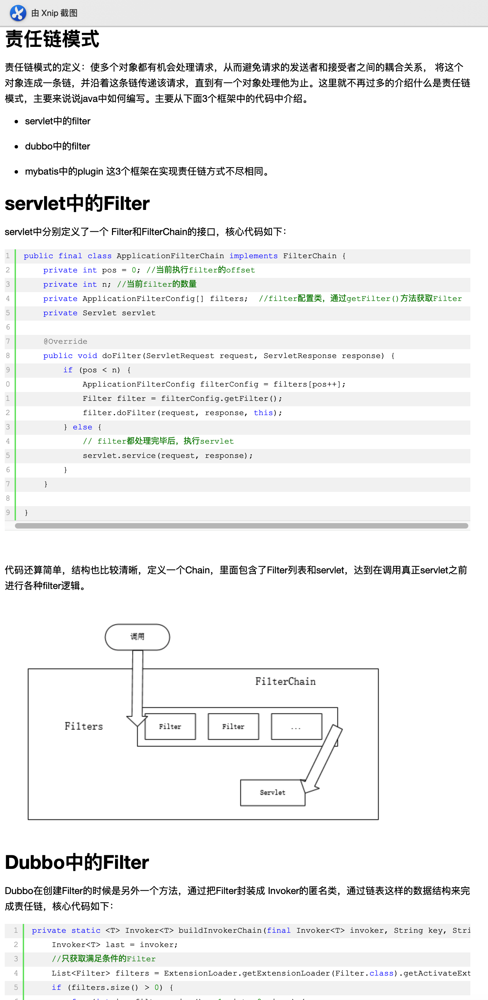

# Java设计模式
## 创建模式
> 创建模式概述：

+ 创建模式(Creational Pattern) 对类的实例化过程进行抽象，能够将软件模块中对象的创建和对象的使用分离。为了使软件的结构更加清晰，外界对于这些对象只需要知道它们共同的接口，而不清楚其具体的实现细节，使整个系统的设计更加符合单一职责原则。
+ 创建型模式在创建什么(What)，由谁创建(Who)，何时创建(When)等方面都为软件设计者提供了尽可能大的灵活性。创建型模式隐藏了类的实例的创建细节，通过隐藏对象如何被创建和组合在一起达到使整个系统独立的目的。


### 单例模式--只有一个实例


### 工厂模式--由对象工程生成对象


### 建造者模式--组装复杂的实例


### 原型模式--通过复制生成实例


## 结构模式
> 结构模式概述

+ **结构型模式(Structural Pattern)**： 描述如何将类或者对象结合在一起形成更大的结构，就像搭积木，可以通过简单积木的组合形成复杂的、功能更为强大的结构 


  
+ **结构型模式可以分为类结构型模式和对象结构型模式：**  

	+ 类结构型模式关心类的组合，由多个类可以组合成一个更大的系统，在类结构型模式中一般只存在继承关系和实现关系。
	+ 对象结构型模式关心类与对象的组合，通过关联关系使得在一个类中定义另一个类的实例对象，然后通过该对象调用其方法。根据“合成复用原则”，在系统中尽量使用关联关系来替代继承关系，因此大部分结构型模式都是对象结构型模式.
	
 

### 适配器模式:
#### 深入理解适配器模式--加个"适配器"以便于复用


##### Spring中使用适配器模式的典型应用
在 Spring 的 AOP 里通过使用的 Advice（通知）来增强被代理类的功能。Spring 实现这一 AOP 功能的原理就使用代理模式（1、JDK 动态代理。2、CGLib 字节码生成技术代理。）对类进行方法级别的切面增强，即，生成被代理类的代理类，并在代理类的方法前，设置拦截器，通过执行拦截器中的内容增强了代理方法的功能，实现的面向切面编程。

Advice（通知）的类型有：BeforeAdvice、AfterReturningAdvice、ThrowSadvice 等。每个类型 Advice（通知）都有对应的拦截器，MethodBeforeAdviceInterceptor、AfterReturningAdviceInterceptor、ThrowsAdviceInterceptor。Spring 需要将每个 Advice（通知）都封装成对应的拦截器类型，返回给容器，所以需要使用适配器模式对 Advice 进行转换。

```
public interface MethodBeforeAdvice extends BeforeAdvice {
    void before(Method method, Object[] args, Object target) throws Throwable;
}

public interface AdvisorAdapter {

    boolean supportsAdvice(Advice advice);

    MethodInterceptor getInterceptor(Advisor advisor);
}

class MethodBeforeAdviceAdapter implements AdvisorAdapter, Serializable {

    @Override
    public boolean supportsAdvice(Advice advice) {
        return (advice instanceof MethodBeforeAdvice);
    }

    @Override
    public MethodInterceptor getInterceptor(Advisor advisor) {
        MethodBeforeAdvice advice = (MethodBeforeAdvice) advisor.getAdvice();
        return new MethodBeforeAdviceInterceptor(advice);
    }

}
```

> 默认的适配器注册表

```
public class DefaultAdvisorAdapterRegistry implements AdvisorAdapterRegistry, Serializable {

    private final List<AdvisorAdapter> adapters = new ArrayList<AdvisorAdapter>(3);

    public DefaultAdvisorAdapterRegistry() {
        // 注册适配器 
        registerAdvisorAdapter(new MethodBeforeAdviceAdapter());
        registerAdvisorAdapter(new AfterReturningAdviceAdapter());
        registerAdvisorAdapter(new ThrowsAdviceAdapter());
    }

    @Override
    public Advisor wrap(Object adviceObject) throws UnknownAdviceTypeException {
        if (adviceObject instanceof Advisor) {
            return (Advisor) adviceObject;
        }
        if (!(adviceObject instanceof Advice)) {
            throw new UnknownAdviceTypeException(adviceObject);
        }
        Advice advice = (Advice) adviceObject;
        if (advice instanceof MethodInterceptor) {
            // So well-known it doesn't even need an adapter.
            return new DefaultPointcutAdvisor(advice);
        }
        for (AdvisorAdapter adapter : this.adapters) {
            // 检查是否支持,这里调用了适配器的方法 
            if (adapter.supportsAdvice(advice)) {
                return new DefaultPointcutAdvisor(advice);
            }
        }
        throw new UnknownAdviceTypeException(advice);
    }

    @Override
    public MethodInterceptor[] getInterceptors(Advisor advisor) throws UnknownAdviceTypeException {
        List<MethodInterceptor> interceptors = new ArrayList<MethodInterceptor>(3);
        Advice advice = advisor.getAdvice();
        if (advice instanceof MethodInterceptor) {
            interceptors.add((MethodInterceptor) advice);
        }
        for (AdvisorAdapter adapter : this.adapters) {
            // 检查是否支持,这里调用了适配器的方法 
            if (adapter.supportsAdvice(advice)) {
                interceptors.add(adapter.getInterceptor(advisor));
            }
        }
        if (interceptors.isEmpty()) {
            throw new UnknownAdviceTypeException(advisor.getAdvice());
        }
        return interceptors.toArray(new MethodInterceptor[interceptors.size()]);
    }

    @Override
    public void registerAdvisorAdapter(AdvisorAdapter adapter) {
        this.adapters.add(adapter);
    }

}

```

##### 总结


#### 适配器模式原理及实例介绍-IBM


### 桥接模式


### 组合模式


### 装饰模式

#### java模式-装饰者模式


#### java设计模式-装饰者模式


### 外观模式(门面模式)


### 享元模式


```
package com.jasongj.factory;
import java.util.concurrent.ConcurrentHashMap;
import org.slf4j.Logger;
import org.slf4j.LoggerFactory;
import com.jasongj.flyweight.ConcreteFlyWeight;
import com.jasongj.flyweight.FlyWeight;
public class FlyWeightFactory {
  private static final Logger LOG = LoggerFactory.getLogger(FlyWeightFactory.class);
  private static ConcurrentHashMap<String, FlyWeight> allFlyWeight = new ConcurrentHashMap<String, FlyWeight>();
  public static FlyWeight getFlyWeight(String name) {
    if (allFlyWeight.get(name) == null) {
      synchronized (allFlyWeight) {
        if (allFlyWeight.get(name) == null) {
          LOG.info("Instance of name = {} does not exist, creating it");
          FlyWeight flyWeight = new ConcreteFlyWeight(name);
          LOG.info("Instance of name = {} created");
          allFlyWeight.put(name, flyWeight);
        }
      }
    }
    return allFlyWeight.get(name);
  }
}

```


### 代理模式
#### IBM出品


#### 轻松学java


##### 动态代理的秘密


#### java代理模式及其应用


## 行为型模式
> 行为型模式概述

+ 行为型模式(Behavioral Pattern)是对在不同的对象之间划分责任和算法的抽象化。
+ 行为型模式不仅仅关注类和对象的结构，而且重点关注它们之间的相互作用。
+ 通过行为型模式，可以更加清晰地划分类与对象的职责，并研究系统在运行时实例对象之间的交互。在系统运行时，对象并不是孤立的，它们可以通过相互通信与协作完成某些复杂功能，一个对象在运行时也将影响到其他对象的运行。  

**行为型模式分为类行为型模式和对象行为型模式两种：**

+ 类行为型模式： 类的行为型模式使用继承关系在几个类之间分配行为，类行为型模式主要通过多态等方式来分配父类与子类的职责。
+ 对象行为型模式： 对象的行为型模式则使用对象的聚合关联关系来分配行为，对象行为型模式主要是通过对象关联等方式来分配两个或多个类的职责。根据“合成复用原则”，系统中要尽量使用关联关系来取代继承关系，因此大部分行为型设计模式都属于对象行为型设计模式。


### 职责链模式

#### 责任链模式、职责链模式


#### 责任链模式实现的三种方式



#####Dubbo中的Filter

```
private static <T> Invoker<T> buildInvokerChain(final Invoker<T> invoker, String key, String group) {
    Invoker<T> last = invoker;
    //只获取满足条件的Filter
    List<Filter> filters = ExtensionLoader.getExtensionLoader(Filter.class).getActivateExtension(invoker.getUrl(), key, group);
    if (filters.size() > 0) {
        for (int i = filters.size() - 1; i >= 0; i --) {
            final Filter filter = filters.get(i);
            final Invoker<T> next = last;
            last = new Invoker<T>() {
                ...
                public Result invoke(Invocation invocation) throws RpcException {
                    return filter.invoke(next, invocation);
                }
                ...
            };
        }
    }
    return last;
}

```


**命令模式：**

**解释器模式：**

**迭代器模式：**

**中介者模式：**

**备忘录模式：**

**观察者模式：**

观察者模式也是非常常用的设计模式，下面这个博客简单介绍了观察者模式的简单定义、解决了一个什么问题，用一个气象站和气象看板的例子去描述一对多的关系中观察者模式的应用，并且还介绍了jdk内置的观察者模式接口。

## 观察者模式

**状态模式：**  
**策略模式：**  
策略模式作为设计原则中开闭原则最典型的体现，也是经常使用的。下面这篇博客介绍了策略模式一般的组成部分和概念，并用了一个小demo去说明了策略模式的应用。

## 策略模式


**模板方法模式：** 

**访问者模式：**