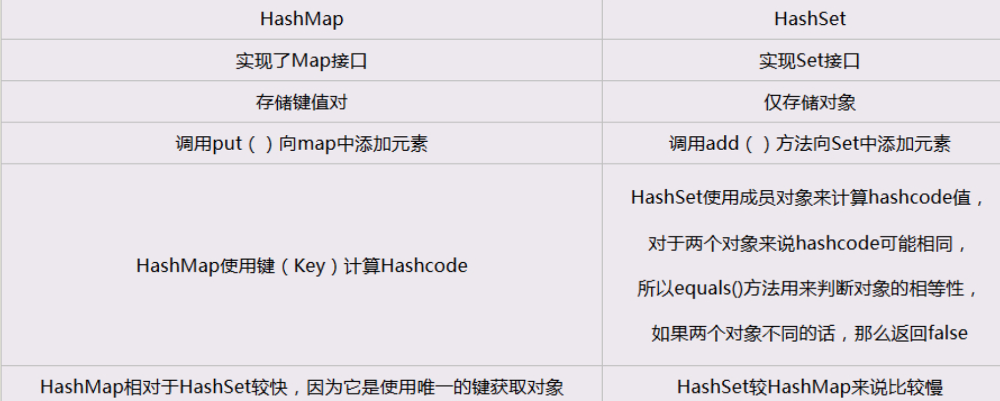

#集合
## 1.List，Set,Map三者的区别及总结
+ **List：对付顺序的好帮手**

> List接口存储一组不唯一（可以有多个元素引用相同的对象），有序的对象

+ **Set:注重独一无二的性质**  

> 不允许重复的集合。不会有多个元素引用相同的对象。

+ **Map:用Key来搜索的专家**

> 使用键值对存储。Map会维护与Key有关联的值。两个Key可以引用相同的对象，但Key不能重复，典型的Key是String类型，但也可以是任何对象。

## 2.Arraylist 与 LinkedList 区别

Arraylist底层使用的是数组（存读数据效率高，插入删除特定位置效率低），LinkedList底层使用的是双向循环链表数据结构（插入，删除效率特别高）。  
学过数据结构这门课后我们就知道采用链表存储，插入，删除元素时间复杂度不受元素位置的影响，都是近似O（1）而数组为近似O（n），因此当数据特别多，而且经常需要插入删除元素时建议选用LinkedList.一般程序只用Arraylist就够用了，因为一般数据量都不会蛮大，Arraylist是使用最多的集合类。
## 3.ArrayList 与 Vector 区别
Vector类的所有方法都是同步的。可以由两个线程安全地访问一个Vector对象、但是一个线程访问Vector ，代码要在同步操作上耗费大量的时间。Arraylist不是同步的，所以在不需要同步时建议使用Arraylist。
## 4.HashMap 和 Hashtable 的区别

+ 1. HashMap是非线程安全的，HashTable是线程安全的；HashTable内部的方法基本都经过synchronized修饰。

+ 2. 因为线程安全的问题，HashMap要比HashTable效率高一点，HashTable基本被淘汰。

+ 3. HashMap允许有null值的存在，而在HashTable中put进的键值只要有一个null，直接抛出NullPointerException。

**Hashtable和HashMap有几个主要的不同:**  
> 线程安全以及速度。仅在你需要完全的线程安全的时候使用Hashtable，而如果你使用Java5或以上的话，请使用ConcurrentHashMap吧
## 5.HashSet 和 HashMap 区别



## 6.HashMap 和 ConcurrentHashMap 的区别
ConcurrentHashMap对整个桶数组进行了分割分段(Segment)，然后在每一个分段上都用lock锁进行保护，相对于HashTable的synchronized锁的粒度更精细了一些，并发性能更好，而HashMap没有锁机制，不是线程安全的。（JDK1.8之后ConcurrentHashMap启用了一种全新的方式实现,利用CAS算法。）
HashMap的键值对允许有null，但是ConCurrentHashMap都不允许。  

[区别](https://blog.csdn.net/xuefeng0707/article/details/40834595)
## 7.什么时候使用ConcurrentHashMap？
快速失败的Java迭代器可能会引发ConcurrentModifcationException在底层集合迭代过程中被修改。故障安全作为发生在实例中的一个副本迭代是不会抛出任何异常的。快速失败的故障安全范例定义了当遭遇故障时系统是如何反应的。例如，用于失败的快速迭代器ArrayList和用于故障安全的迭代器ConcurrentHashMap。

ConcurrentHashMap被作为故障安全迭代器的一个实例，它允许完整的并发检索和更新。
当有大量的并发更新时，ConcurrentHashMap此时可以被使用。这非常类似于Hashtable，但ConcurrentHashMap不锁定整个表来提供并发，所以从这点上ConcurrentHashMap的性能似乎更好一些。所以当有大量更新时ConcurrentHashMap应该被使用。
## 8.IdentityHashMap和HashMap的区别?
1.前者比较key时是“引用相等”而后者是“对象相等”，即对于k1和k2，当k1==k2时， 
IdentityHashMap认为两个key相等，而HashMap只有在k1.equals(k2) == true 时
才会认为两个key相等。 

2.IdentityHashMap 允许使用null作为key和value. 不保证任何Key-value对的之间的顺序, 更不能保证他们的顺序随时间的推移不会发生变化。 

3.IdentityHashMap有其特殊用途，比如序列化或者深度复制。或者记录对象代理。 举个例子，jvm中的所有对象都是独一无二的，哪怕两个对象是同一个class的对象 而且两个对象的数据完全相同，对于jvm来说，他们也是完全不同的， 如果要用一个map来记录这样jvm中的对象，你就需要用IdentityHashMap，而不能使用其他Map实现 

## 9.HashSet如何检查重复
当你把对象加入HashSet时，HashSet会先计算对象的hashcode值来判断对象加入的位置，同时也会与其他加入的对象的hashcode值作比较，如果没有相符的hashcode，HashSet会假设对象没有重复出现。但是如果发现有相同hashcode值的对象，这时会调用equals（）方法来检查hashcode相等的对象是否真的相同。如果两者相同，HashSet就不会让加入操作成功。

**hashCode（）与equals（）的相关规定：**

如果两个对象相等，则hashcode一定也是相同的两个对象相等,对两个equals方法返回true两个对象有相同的hashcode值，它们也不一定是相等的综上，equals方法被覆盖过，则hashCode方法也必须被覆盖hashCode()的默认行为是对堆上的对象产生独特值。如果没有重写hashCode()，则该class的两个对象无论如何都不会相等（即使这两个对象指向相同的数据）。

## 10.==与equals的区别
+ 1.==是判断两个变量或实例是不是指向同一个内存空间 equals是判断两个变量或实例所指向的内存空间的值是不是相同
+ 2.==是指对内存地址进行比较 equals()是对字符串的内容进行比较
+ 3.==指引用是否相同 equals()指的是值是否相同

## 11.comparable 和 comparator的不同之处？

```
1. comparable接口实际上是出自java.lang包 
它有一个 compareTo(Object obj)方法用来排序
2. comparator接口实际上是出自 java.util 
包它有一个compare(Object obj1, Object obj2)方法用来排序

```
> 一般我们需要对一个集合使用自定义排序时，我们就要重写compareTo方法或compare方法，当我们需要对某一个集合实现两种排序方式，比如一个song对象中的歌名和歌手名分别采用一种排序方法的话，我们可以重写compareTo方法和使用自制的Comparator方法或者以两个Comparator来实现歌名排序和歌星名排序，第二种代表我们只能使用两个参数版的Collections.sort().


**Comparable可以认为是一个内比较器，  **
实现了Comparable接口的类有一个特点，就是这些类是可以和自己比较的，至于具体和另一个实现了Comparable接口的类如何比较，则依赖compareTo方法的实现，compareTo方法也被称为自然比较方法。如果开发者add进入一个Collection的对象想要Collections的sort方法帮你自动进行排序的话，那么这个对象必须实现Comparable接口。  
**compareTo方法的返回值是int，**  
**有三种情况：**  
1、比较者大于被比较者（也就是compareTo方法里面的对象），那么返回正整数  
2、比较者等于被比较者，那么返回0  
3、比较者小于被比较者，那么返回负整数  


**Comparator可以认为是是一个外比较器，**
> 个人认为有两种情况可以使用实现Comparator接口的方式： 

+ 1、一个对象不支持自己和自己比较（没有实现Comparable接口），但是又想对两个对象进行比较
+ 2、一个对象实现了Comparable接口，但是开发者认为compareTo方法中的比较方式并不是自己想要的那种比较方式

> Comparator接口里面有一个compare方法，方法有两个参数T o1和T o2，是泛型的表示方式，分别表示待比较的两个对象，方法返回值和Comparable接口一样是int  

**有三种情况：** 
> 1、o1大于o2，返回正整数
> 2、o1等于o2，返回0
> 3、o1小于o2，返回负整数

**总结**  
> 两种比较器Comparable和Comparator，后者相比前者有如下优点：  

+ 1、如果实现类没有实现Comparable接口，又想对两个类进行比较或者实现类实现了Comparable接口，但是对compareTo方法内的比较算法不满意，那么可以实现Comparator接口，自定义一个比较器，写比较算法

+ 2、实现Comparable接口的方式比实现Comparator接口的耦合性要强一些，如果要修改比较算法，要修改Comparable接口的实现类，而实现Comparator的类是在外部进行比较的，不需要对实现类有任何修 改。从这个角度说，其实有些不太好，尤其在我们将实现类的.class文件打成一个.jar文件提供给开发者使用的时候。实际上实现Comparator 接口的方式后面会写到就是一种典型的策略模式。

+  当然，这不是鼓励用Comparator，意思是开发者还是要在具体场景下选择最合适的那种比较器而已。

## 12.Iterator、ListIterator 和 Enumeration的区别？
迭代器是一种设计模式，它是一个对象，它可以遍历并选择序列中的对象，而开发人员不需要了解该序列的底层结构。迭代器通常被称为“轻量级”对象，因为创建它的代价小。Java中的Iterator功能比较简单，
**并且只能单向移动：**  

(1) 使用方法iterator()要求容器返回一个Iterator。第一次调用Iterator的next()方法时，它返回序列的第一个元素。注意：iterator()方法是java.lang.Iterable接口被Collection继承。  

(2) 使用next()获得序列中的下一个元素。  

(3) 使用hasNext()检查序列中是否还有元素。  

(4) 使用remove()将迭代器新返回的元素删除。Iterator是Java迭代器最简单的实现，为List设计的ListIterator具有更多的功能，它可以从两个方向遍历List也可以从List中插入和删除元素。  

**ListIterator的特点:**  

它的父类接口是Iterator，名称是系列表迭代器，允许程序员按任一方向遍历列表、
迭代期间修改列表，并获得迭代器在列表中的当前位置。ListIterator没有当前元素，它的光标位置始终位于调用previous()所返回的元素和调用next()所返回的元素之间。长度为n的列表的迭代器有n+1个可能的指针位置。  

**Enumeration的特点:**  

API中是这样描述的,它主要是和Vector结合配套使用。另外此接口的功能与Iterator接口的功能是重复的，此外,Iterator接口添加了一个可选的移除操作，并且使用较短的方法名。新的实现应该优先考虑使用Iterator接口而不是Enumeration接口。

**java中的集合类都提供了返回Iterator的方法，就是迭代器，它和Enumeration的主要区别其实就是Iterator可以删除元素，但是Enumration却不能。**

## 13.如何对Object的list排序
+ 对objects数组进行排序，我们可以用Arrays.sort()方法
+ 对objects的集合进行排序，需要使用Collections.sort()方法

## 14.如何实现数组与List的相互转换

+ List转数组：toArray(arraylist.size()方法；
+ 数组转List:Arrays的asList(a)方法

## 15.如何求ArrayList集合的交集 并集 差集 去重复并集

**需要用到List接口中定义的几个方法：**

addAll(Collection<? extends E> c) :按指定集合的Iterator返回的顺序将指定集合中的所有元素追加到此列表的末尾 实例代码：  
retainAll(Collection<?> c): 仅保留此列表中包含在指定集合中的元素。  
removeAll(Collection<?> c) :从此列表中删除指定集合中包含的所有元素。

## 16.HashMap 的工作原理及代码实现
[集合框架源码学习之HashMap(JDK1.8)](https://juejin.im/post/5ab0568b5188255580020e56)
## 17.ConcurrentHashMap 的工作原理及代码实现
[ConcurrentHashMap实现原理及源码分析](http://www.cnblogs.com/chengxiao/p/6842045.html)

## 18.集合框架底层数据结构总结

### - Collection

**1. List**

+ Arraylist：数组（查询快,增删慢 线程不安全,效率高 ）
+ Vector：数组（查询快,增删慢 线程安全,效率低 ）
+ LinkedList：链表（查询慢,增删快 线程不安全,效率高 ）

**2. Set**

+ HashSet（无序，唯一）:哈希表或者叫散列集(hash table)
+ LinkedHashSet：链表和哈希表组成 。 由链表保证元素的排序 ， 由哈希表证元素的唯一性
+ TreeSet（有序，唯一）：红黑树(自平衡的排序二叉树。)

### - Map

+ HashMap：基于哈希表的Map接口实现（哈希表对键进行散列，Map结构即映射表存放键值对）
+ LinkedHashMap:HashMap 的基础上加上了链表数据结构
+ HashTable:哈希表
+ TreeMap:红黑树（自平衡的排序二叉树）

## 19.集合的选用
主要根据集合的特点来选用，比如我们需要根据键值获取到元素值时就选用Map接口下的集合，需要排序时选择TreeMap,不需要排序时就选择HashMap,需要保证线程安全就选用ConcurrentHashMap.  
当我们只需要存放元素值时，就选择实现Collection接口的集合，需要保证元素唯一时选择实现Set接口的集合比如TreeSet或HashSet，不需要就选择实现List接口的比如ArrayList或LinkedList，然后再根据实现这些接口的集合的特点来选用。

# 下面的是重点：

## 20.Arraylist 与 LinkedList 异同


1. **是否保证线程安全：** ArrayList 和 LinkedList 都是不同步的，也就是不保证线程安全；
2. **底层数据结构：** Arraylist 底层使用的是Object数组；LinkedList 底层使用的是双向链表数据结构（JDK1.6之前为循环链表，JDK1.7取消了循环。注意双向链表和双向循环链表的区别：）； 详细可阅读JDK1.7-LinkedList循环链表优化
3. **插入和删除是否受元素位置的影响： **① ArrayList 采用数组存储，所以插入和删除元素的时间复杂度受元素位置的影响。 比如：执行add(E e) 方法的时候， ArrayList 会默认在将指定的元素追加到此列表的末尾，这种情况时间复杂度就是O(1)。但是如果要在指定位置 i 插入和删除元素的话（add(int index, E element) ）时间复杂度就为 O(n-i)。因为在进行上述操作的时候集合中第 i 和第 i 个元素之后的(n-i)个元素都要执行向后位/向前移一位的操作。 ② LinkedList 采用链表存储，所以插入，删除元素时间复杂度不受元素位置的影响，都是近似 O（1）而数组为近似 O（n）。
4. **是否支持快速随机访问：** LinkedList 不支持高效的随机元素访问，而 ArrayList 支持。快速随机访问就是通过元素的序号快速获取元素对象(对应于get(int index) 方法)。
5. **内存空间占用：** ArrayList的空 间浪费主要体现在在list列表的结尾会预留一定的容量空间，而LinkedList的空间花费则体现在它的每一个元素都需要消耗比ArrayList更多的空间（因为要存放直接后继和直接前驱以及数据）。  

**补充内容:RandomAccess接口**

		public interface RandomAccess {}

查看源码我们发现实际上 RandomAccess 接口中什么都没有定义。所以，在我看来 RandomAccess 接口不过是一个标识罢了。标识什么？ 标识实现这个接口的类具有随机访问功能。

在binarySearch（）方法中，它要判断传入的list 是否RamdomAccess的实例，如果是，调用indexedBinarySearch（）方法，如果不是，那么调用iteratorBinarySearch（）方法

    public static <T>
    int binarySearch(List<? extends Comparable<? super T>> list, T key) {
        if (list instanceof RandomAccess || list.size()<BINARYSEARCH_THRESHOLD)
            return Collections.indexedBinarySearch(list, key);
        else
            return Collections.iteratorBinarySearch(list, key);
    }
ArraysList 实现了 RandomAccess 接口， 而 LinkedList 没有实现。为什么呢？我觉得还是和底层数据结构有关！ArraysList 底层是数组，而 LinkedList 底层是链表。数组天然支持随机访问，时间复杂度为 O（1），所以称为快速随机访问。链表需要遍历到特定位置才能访问特定位置的元素，时间复杂度为 O（n），所以不支持快速随机访问。，ArraysList 实现了 RandomAccess 接口，就表明了他具有快速随机访问功能。 RandomAccess 接口只是标识，并不是说 ArraysList 实现 RandomAccess 接口才具有快速随机访问功能的！

**下面再总结一下 list 的遍历方式选择：**

+ 实现了RandomAccess接口的list，优先选择普通for循环 ，其次foreach,
+ 未实现RandomAccess接口的ist， 优先选择iterator遍历（foreach遍历底层也是通过iterator实现的），大size的数据，千万不要使用普通for循环
**补充：数据结构基础之双向链表**

双向链表也叫双链表，是链表的一种，它的每个数据结点中都有两个指针，分别指向直接后继和直接前驱。所以，从双向链表中的任意一个结点开始，都可以很方便地访问它的前驱结点和后继结点。一般我们都构造双向循环链表，如下图所示，同时下图也是LinkedList 底层使用的是双向循环链表数据结构。

## 21.ArrayList 与 Vector 区别
Vector类的所有方法都是同步的。可以由两个线程安全地访问一个Vector对象、但是一个线程访问Vector的话代码要在同步操作上耗费大量的时间。

Arraylist不是同步的，所以在不需要保证线程安全时时建议使用Arraylist。

## 22.HashMap的底层实现

**JDK1.8之前** 

JDK1.8 之前 HashMap 底层是 **数组和链表 结合在一起使用也就是 链表散列。HashMap 通过 key 的 hashCode 经过扰动函数处理过后得到 hash 值，然后通过 (n - 1) & hash 判断当前元素存放的位置（这里的 n 指的是数组的长度），如果当前位置存在元素的话，就判断该元素与要存入的元素的 hash 值以及 key 是否相同，如果相同的话，直接覆盖，不相同就通过拉链法解决冲突。**

**所谓扰动函数指的就是 HashMap 的 hash 方法。使用 hash 方法也就是扰动函数是为了防止一些实现比较差的 hashCode() 方法 换句话说使用扰动函数之后可以减少碰撞。**

**JDK 1.8 HashMap 的 hash 方法源码:**

> JDK 1.8 的 hash方法 相比于 JDK 1.7 hash 方法更加简化，但是原理不变。

    static final int hash(Object key) {
      int h;
      // key.hashCode()：返回散列值也就是hashcode
      // ^ ：按位异或
      // >>>:无符号右移，忽略符号位，空位都以0补齐
      return (key == null) ? 0 : (h = key.hashCode()) ^ (h >>> 16);
  	}
**对比一下 JDK1.7的 HashMap 的 hash 方法源码.**

	static int hash(int h) {
    	// This function ensures that hashCodes that differ only by
    	// constant multiples at each bit position have a bounded
    	// number of collisions (approximately 8 at default load factor).

    	h ^= (h >>> 20) ^ (h >>> 12);
    	return h ^ (h >>> 7) ^ (h >>> 4);
	}
> 相比于 JDK1.8 的 hash 方法 ，JDK 1.7 的 hash 方法的性能会稍差一点点，因为毕竟扰动了 4 次。

所谓 **“拉链法”** 就是：将链表和数组相结合。也就是说创建一个链表数组，数组中每一格就是一个链表。若遇到哈希冲突，则将冲突的值加到链表中即可。


**JDK1.8之后**

相比于之前的版本， JDK1.8之后在解决哈希冲突时有了较大的变化，当链表长度大于阈值（默认为8）时，将链表转化为红黑树，以减少搜索时间。


> TreeMap、TreeSet以及JDK1.8之后的HashMap底层都用到了红黑树。红黑树就是为了解决二叉查找树的缺陷，因为二叉查找树在某些情况下会退化成一个线性结构。

## 23.HashMap 和 Hashtable 的区别
1.**线程是否安全：** HashMap 是非线程安全的，HashTable 是线程安全的；HashTable 内部的方法基本都经过 synchronized 修饰。（如果你要保证线程安全的话就使用 ConcurrentHashMap 吧！）；  
2.**效率：** 因为线程安全的问题，HashMap 要比 HashTable 效率高一点。另外，HashTable 基本被淘汰，不要在代码中使用它；  
3.**对Null key 和Null value的支持：** HashMap 中，null 可以作为键，这样的键只有一个，可以有一个或多个键所对应的值为 null。。但是在 HashTable 中 put 进的键值只要有一个 null，直接抛出 NullPointerException。  
4.**初始容量大小和每次扩充容量大小的不同 :**

+ ①创建时如果不指定容量初始值，Hashtable 默认的初始大小为11，之后每次扩充，容量变为原来的2n+1。HashMap 默认的初始化大小为16。之后每次扩充，容量变为原来的2倍。
+ ②创建时如果给定了容量初始值，那么 Hashtable 会直接使用你给定的大小，而 HashMap 会将其扩充为2的幂次方大小（HashMap 中的tableSizeFor()方法保证，下面给出了源代码）。也就是说 HashMap 总是使用2的幂作为哈希表的大小,后面会介绍到为什么是2的幂次方。  
5.**底层数据结构： **JDK1.8 以后的 HashMap 在解决哈希冲突时有了较大的变化，当链表长度大于阈值（默认为8）时，将链表转化为红黑树，以减少搜索时间。Hashtable 没有这样的机制。

## 24.HashMap 的长度为什么是2的幂次方
为了能让 HashMap 存取高效，尽量较少碰撞，也就是要尽量把数据分配均匀。我们上面也讲到了过了，Hash 值的范围值-2147483648到2147483647，前后加起来大概40亿的映射空间，只要哈希函数映射得比较均匀松散，一般应用是很难出现碰撞的。  
但问题是一个40亿长度的数组，内存是放不下的。所以这个散列值是不能直接拿来用的。用之前还要先做对数组的长度取模运算，得到的余数才能用来要存放的位置也就是对应的数组下标。这个数组下标的计算方法是“ (n - 1) & hash ”。（n代表数组长度）。这也就解释了 HashMap 的长度为什么是2的幂次方。

**这个算法应该如何设计呢？**

我们首先可能会想到采用%取余的操作来实现。但是，重点来了：“取余(%)操作中如果除数是2的幂次则等价于与其除数减一的与(&)操作（也就是说 hash%length==hash&(length-1)的前提是 length 是2的 n 次方；）。” 并且 采用二进制位操作 &，相对于%能够提高运算效率，这就解释了 HashMap 的长度为什么是2的幂次方。

## 25.HashSet 和 HashMap 区别
如果你看过 HashSet 源码的话就应该知道：HashSet 底层就是基于 HashMap 实现的。（HashSet 的源码非常非常少，因为除了 clone() 方法、writeObject()方法、readObject()方法是 HashSet 自己不得不实现之外，其他方法都是直接调用 HashMap 中的方法。）
## 26.ConcurrentHashMap 和 Hashtable 的区别
ConcurrentHashMap 和 Hashtable 的区别主要体现在实现线程安全的方式上不同。

**底层数据结构：**  

+  JDK1.7的 ConcurrentHashMap 底层采用 分段的数组+链表 实现，JDK1.8 采用的数据结构跟HashMap1.8的结构一样，数组+链表/红黑二叉树。
+  Hashtable 和 JDK1.8 之前的 HashMap 的底层数据结构类似都是采用 数组+链表 的形式，数组是 HashMap 的主体，链表则是主要为了解决哈希冲突而存在的；  
  
**实现线程安全的方式（重要）：**   

+ ① 在JDK1.7的时候，ConcurrentHashMap（分段锁） 对整个桶数组进行了分割分段(Segment)，每一把锁只锁容器其中一部分数据，多线程访问容器里不同数据段的数据，就不会存在锁竞争，提高并发访问率。 到了 JDK1.8 的时候已经摒弃了Segment的概念，而是直接用 Node 数组+链表+红黑树的数据结构来实现，并发控制使用 synchronized 和 CAS 来操作。（JDK1.6以后 对 synchronized锁做了很多优化） 整个看起来就像是优化过且线程安全的 HashMap，虽然在JDK1.8中还能看到 Segment 的数据结构，但是已经简化了属性，只是为了兼容旧版本；  
+ ② Hashtable(同一把锁) :使用 synchronized 来保证线程安全，效率非常低下。当一个线程访问同步方法时，其他线程也访问同步方法，可能会进入阻塞或轮询状态，如使用 put 添加元素，另一个线程不能使用 put 添加元素，也不能使用 get，竞争会越来越激烈效率越低。

## 27.如何将一个字符串转换为arraylist?

```
string 转 ArrayList
先将字符串按照某个字符切割，转为string数组
然后用Arrays的asList方法，将数组转为List
public class test1 {
    public static void main(String[] args)  {
        //string 转 ArrayList
        String str1 = "a,b,c";
        ArrayList<String> list = 
        new ArrayList<String>(Arrays.asList(str1.split(",")));
        System.out.println(list);
    }
}

ArrayList 转 string
public class test1 {
    public static void main(String[] args)  {
        //ArrayList 转 string
        ArrayList<String> list = new ArrayList<String>();

        list.add("a");
        list.add("b");
        list.add("c");

        System.out.println(list);//[a, b, c]

        String list_str = StringUtils.join(list,",");

        System.out.println(list_str);//a,b,c
    }
}

```
## 28.array 和 arraylist 的区别？

**两者间的区别：**

Array 的容量是固定的，ArrayList 的容量是根据需求自动扩展ArrayList 提供了 添加、插入或移除某一范围元素的方法而 Array 中，只能一次获取或设置一个元素值用Synchronized方法可以很容易地创建ArrayList的同步版本而 Array 将一直保持它知道用户实现同步为止array 数组的用法  

`type [] name = new type [size]；`  

<font color= "red">**注意：** </font>size不能省略，type前后要一致
<font color= "red">缺点：</font>在数据间插入数据是

ArrayList 动态数组的用法是 Array 的复杂版本动态的增加和减少元素，实现 ICollection 和 IList 接口灵活的设置数组大小

## 29.hashCode() 和 equals() 方法的重要性？如何在Java中使用它们？
Java中的HashMap使用hashCode()和equals()方法来确定键值对的索引，当根据键获取值的时候也会用到这两个方法。 如果没有正确的实现这两个方法，两个不同的键可能会有相同的hash值，因此可能会被集合认为是相等的。 而且，这两个方法也用来发现重复元素，所以这两个方法的实现对HashMap的精确性和正确性是至关重要的。

同一个对象（没有发生过修改）无论何时调用hashCode()，得到的返回值必须一样。hashCode()返回值相等，对象不一定相等，通过hashCode()和equals()必须能唯一确定一个对象。一旦重写了equals()，就必须重写hashCode()。而且hashCode()生成哈希值的依据应该是equals()中用来比较是否相等的字段。如果两个由equals()规定相等的对象生成的hashCode不等，对于HashMap来说，他们可能分别映射到不同位置，没有调用equals()比较是否相等的机会，两个实际上相等的对象可能被插入到不同位置，出现错误。其他一些基于哈希方法的集合类  

**可能也会有这个问题。**

怎么判断两个对象是相同的？
使用等号== 判断两个对象是否相同，
这种是严格的相同，
即内存中的同一个对象
 Object的equal方法就是使用==判断两个对象是否相同


**集合set要求元素是唯一的，怎么实现？**  


要实现元素的唯一，
需要在往集合set中添加元素时，
判断集合set是否存在相同的元素，
如果存在，则不添加，反之。  

**那么怎么确定两个元素是否相同**  

+ 1.如果是使用等号==判断两个元素是否相同，
即默认使用Object的equals的方法。
+ 2.如果没有使用等号==判断两个元素是否相同，
而是按照某种业务规则判断两个元素是否相同，
即重写了Object的equals的方法。

**当重写equals方法，必须重写hashCode方法吗？**  

**不是必须的,要看具体的情况**

+ 当equals方法返回的结果和使用等号
比较的结果是一致的时候，
是没有必要重写hashCode方法。
当用等号比较对象，
只有是内存中同一个对象实例，
才会返回true，
当然调用其hashCode（）方法
肯定返回相同的值，
这满足了满足了hashCode的约束条件，
所以不用重写hashCode（）方法。

+ 当equals方法返回的结果
和使用等号比较的结果是不一致的时候，
就需要重写hashCode方法。
当重写后的equals方法
不认为只有是在内存中同一个对象实例，
才返回true，
如果不重新hashCode方法（）
Object的hashCode（）方法 是对内存地址的映射，
hashCode方法返回的值肯定是不同的，
这违背了hashCode的约束条件，
所以必须要重新hashCode方法，
并满足对hashCode的约束条件。

## 30.是否可以往 TreeSet 或者 HashSet 中添加 null 元素？
+ 1.TreeSet 是二差树实现的,
Treeset中的数据是自动排好序的，
不允许放入null值 

+ 2.HashSet 是哈希表实现的,
HashSet中的数据是无序的，
可以放入null，
但只能放入一个null，
两者中的值都不能重复，
就如数据库中唯一约束 

+ 3.HashSet要求放入的对象
必须实现HashCode()方法，
放入的对象，是以hashcode码作为标识的，
而具有相同内容的String对象，
hashcode是一样，
所以放入的内容不能重复。
但是同一个类的对象可以放入不同的实例
## 31.如何保证一个集合线程安全？

Java提供了不同层面的线程安全支持。在传统集合框架内部，除了Hashtable等同步容器，还提供了所谓的同步包装器（Synchronized Wrapper），可以调用Collections工具类提供的包装方法，来获取一个同步的包装容器，例如`Collections.synchronizedMap()`

**但是**它们都是利用非常粗粒度的同步方式，在高并发情况下的性能比较低下。  
**另外**更加普遍的选择是利用并发包（java.util.concurrent）    
**提供的线程安全容器类：**  
<font color="red">各种并发容器</font>
> 比如ConcurrentHashMap、CopyOnWriteArrayList。  

<font color="red">各种线程安全队列（Queue/Deque）</font>
> 比如ArrayBlockingQueue、SynchronousQueue。  

<font color="red">各种有序容器的线程安全版本等。</font>  
**具体保证线程安全的方式**

> 包括有从简单的synchronized方式，到基于更加精细化的，
比如基于分离锁实现的ConcurrentHashMap等并发实现等。
具体选择要看开发的场景需求，
总体来说，
并发包内提供的容器通用场景，
远远优于早期的简单同步实现。

**为什么需要ConcurrentHashMap**
> 首先，Hashtable本身比较低效，因为它的实现基本就是将put、get、size等方法简单粗暴地加上“synchronized”。这就导致了所有并发操作都要竞争同一把锁，一个线程在进行同步操作时，其它线程只能等待，大大降低了并发操作的性能。

## 32.什么类实现了List接口？
List接口的实现类中最经常使用最重要的就是这三个：  
`ArrayList、Vector、LinkedList`

+ 1.三个都直接实现了AbstractList这个抽象类
+ 2,ArrayList和Vector都实现了RandomAccess接口。而LinkedList没有。  这是什么意思呢?在JDK 中，RandomAccess接口是一个空接口，所以它没有实际意义。就是一个标记，标记这个类支持高速随机訪问，所以，arrayList和 vector是支持随机訪问的，可是LinkedList不支持持         
+ 3.serializbale接口表明他们都支持序列化。

## 33.什么类实现了Set接口？

`HashSet/LinkedHashSet/TreeSet`

+ HashSet是使用哈希表（hash table）实现的，
其中的元素是无序的。
HashSet的
add、
remove、
contains方法 
的时间复杂度为常量O(1)。

+ TreeSet使用树形结构
算法书中的红黑树red-black tree
实现的。
TreeSet中的元素是可排序的，
但add、remove和contains方法的时间
复杂度为O(log(n))。
TreeSet还提供了
first()、
last()、
headSet()、
tailSet()等
方法来操作排序后的集合。

+ LinkedHashSet介于HashSet和TreeSet之间。
它基于一个由链表实现的哈希表，
保留了元素插入顺序。
LinkedHashSet中基本方法的
时间复杂度为O(1)。

## 32.HashMap的实现原理

+ HashMap的主干是一个Entry数组。
Entry是HashMap的基本组成单元，
每一个Entry包含一个key-value键值对。

+ HashMap基于hashing原理，
我们通过put()和get()方法储存和获取对象。
当我们将键值对传递给put()方法时，
它调用键对象的hashCode()方法
来计算hashcode，
让后找到bucket位置来储存值对象。
当获取对象时，
通过键对象的equals()方法
找到正确的键值对，
然后返回值对象。
HashMap使用链表来解决碰撞问题，
当发生碰撞了，
对象将会储存在链表的下一个节点中。
 HashMap在每个链表节点中储存键值对对象。

+ 当两个不同的键对象的hashcode
相同时会发生什么？ 
它们会储存在同一个bucket位置的链表中。
键对象的equals()方法用来找到键值对。

+ 因为HashMap的好处非常多，
我曾经在电子商务的应用中使用HashMap作为缓存。
因为金融领域非常多的运用Java，
也出于性能的考虑，
我们会经常用到HashMap和ConcurrentHashMap。


+ HashMap由数组+链表组成的，
数组是HashMap的主体，
链表则是主要为了解决哈希冲突而存在的，
如果定位到的数组位置不含链表
当前entry的next指向null,
那么对于查找，
添加等操作很快，
仅需一次寻址即可；
如果定位到的数组包含链表，
对于添加操作，
**其时间复杂度为O(n)**
首先遍历链表，
存在即覆盖，
否则新增；
对于查找操作来讲，
仍需遍历链表，
然后通过key对象的equals方法逐一比对查找。
所以，性能考虑，HashMap中的链表出现越少，
性能才会越好。

## 33.集合框架中的泛型有什么优点？

**首先**  

> 了解一下Java关于泛型的概念。
泛型，在C++中被称为模板，
就是一种抽象的编程方式。
当我们定义类和方法的时候，
可以用一种通用的方式进行定义，
而不必写出具体的类，
这些未知的东西会在真正使用的时候在确定。

> 对于集合类来说，
它们可以存放各种类型的元素。
如果在存放之前，
就能确定元素的类型，
那么就可以更加直观，
也让代码更加简洁。

**说明：**  

> java的泛型是停留在编译层的，
也就是说JVM在对待泛型数据的时候，
依然会把它们看成是Object类型，
只不过在使用这些元素的时候，
JVM会自动帮助我们进行相应的类型转换。

**总结：** 

> 集合使用泛型之后，
可以达到元素类型明确的目的，
避免了手动类型转换的过程，
同时，也让我们更加明确
容器保存的是什么类型的数据。

## 34.哪些集合类是线程安全的？

在集合框架中，有些类是线程安全的，
这些都是jdk1.1中的出现的。
在jdk1.2之后，
就出现许许多多非线程安全的类。
下面是这些线程安全的同步的类：

**vector：**
就比arraylist多了个同步化机制（线程安全），
因为效率较低，
现在已经不太建议使用。
在web应用中，
特别是前台页面，
往往效率（页面响应速度）是优先考虑的。

**statck：** 
堆栈类，先进后出

**hashtable：**就比hashmap多了个线程安全

**enumeration：**枚举，相当于迭代器

除了这些之外，
其他的都是非线程安全的类和接口。

线程安全的类其方法是同步的，
每次只能一个访问。
是重量级对象，
效率较低。

## 35.一个List实现了最快插入？
+ LinkedList和ArrayList
是另个不同变量列表的实现。
ArrayList的优势在于动态的增长数组，
非常适合初始时总长度未知的情况下使用。
LinkedList的优势在于在中间位置插入和删除操作，
速度是最快的。

+ LinkedList实现了List接口，
允许null元素。
此外LinkedList提供额外的
get，remove，insert方法
在LinkedList的首部或尾部。
这些操作使LinkedList可被
用作堆栈（stack），
队列（queue）
或双向队列（deque）。

+ ArrayList实现了可变大小的数组。
它允许所有元素，
包括null。 
每个ArrayList实例都有一个容量（Capacity），
即用于存储元素的数组的大小。
这个容量可随着不断添加新元素而自动增加，
但是增长算法并没有定义。
当需要插入大量元素时，
在插入前可以调用ensureCapacity方法来
增加ArrayList的容量以提高插入效率。

## 36.迭代器和枚举之间的区别?
在Java集合中，
我们通常都通过 “Iterator(迭代器)” 
或 “Enumeration(枚举类)” 去遍历集合。
Enumeration是一个接口，它的源码如下：

		package java.util;
		public interface Enumeration<E> {
		  boolean hasMoreElements()
		  E nextElement();
		}
		Iterator也是一个接口，它的源码如下:
		package java.util;
		public interface Iterator<E> {
		  boolean hasNext();
		  E next();
		  void remove();
		}

**区别：**  

+ 1 函数接口不同
Enumeration只有2个函数接口。
通过Enumeration，
我们只能读取集合的数据，
而不能对数据进行修改。
Iterator只有3个函数接口。
Iterator除了能读取集合的数据之外，
也能数据进行删除操作。  
+ 2.Iterator支持fail-fast机制，而Enumeration不支持。
Enumeration 是JDK 1.0添加的接口。 
使用到它的函数包括Vector、Hashtable等类，
这些类都是JDK 1.0中加入的，
Enumeration存在的目的
就是为它们提供遍历接口。
Enumeration本身并没有支持同步，
而在Vector、Hashtable实现Enumeration时，
添加了同步。
而Iterator 是JDK 1.2才添加的接口，
它也是为了HashMap、ArrayList等集合
提供遍历接口。
Iterator是支持fail-fast机制的：
当多个线程对同一个集合的内容进行操作时，
就可能会产生fail-fast事件。
Java API规范建议，
对于较新的程序，
Iterator应优先于Enumeration，
因为“ Iterator在Java集合框架中
代替Enumeration。”
## 36.Hashmap如何同步?

+ 1、使用 synchronized 关键字，
这也是最原始的方法。

		synchronized(anObject)  
		{  
		    value = map.get(key);  
		}  
+ 2、使用 JDK1.5 提供的锁

		Java.util.concurrent.locks.Lock
		lock.lock();  
		value = map.get(key);  
		lock.unlock();  

+ 3.可以使用 JDK1.5 提供的读写锁

		java.util.concurrent.locks.ReadWriteLock
		rwlock.readLock().lock();  
		value = map.get(key);  
		rwlock.readLock().unlock();  
		
+ 4.使用 JDK1.5 提供的 

		java.util.concurrent.ConcurrentHashMap 类
		该类将 Map 的存储空间分为若干块，
		每块拥有自己的锁，
		大大减少了多个线程
		争夺同一个锁的情况
		value = map.get(key); 

+  1、不同步确实最快，与预期一致。 
+ 2、四种同步方式中，ConcurrentHashMap 是最快的，接近不同步的情况。 
3、synchronized 关键字非常慢
+ 4、使用读写锁的读锁，比普通所稍慢。

+ 1、如果 ConcurrentHashMap 够用，则使用 ConcurrentHashMap。 
+ 2、如果需自己实现同步，则使用 JDK1.5 提供的锁机制，避免使用 synchronized 关键字。 

## 37.如何获取某个日期是当月的最后一天?
		import java.util.Calendar;
		
		public class Test {
		
			public static void main(String[] args) {
		  		System.out.println(daysCount(2010, 2));
			}
		
			public static int daysCount(int year, int month) {
		  		Calendar cal = Calendar.getInstance();
		  		cal.set(Calendar.YEAR, year);
		  		cal.set(Calendar.MONTH, month);
		  		cal.set(Calendar.DATE, 0);
		  		return cal.get(Calendar.DATE);
			}
		}