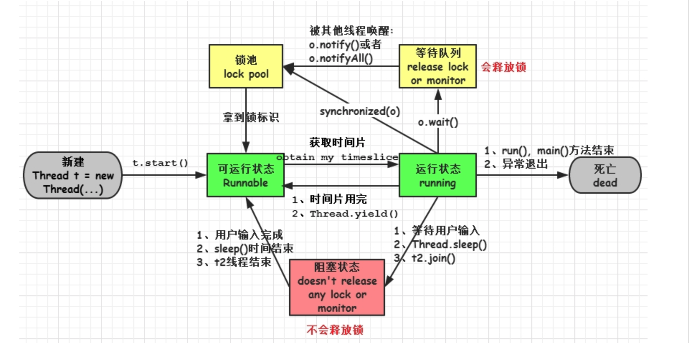
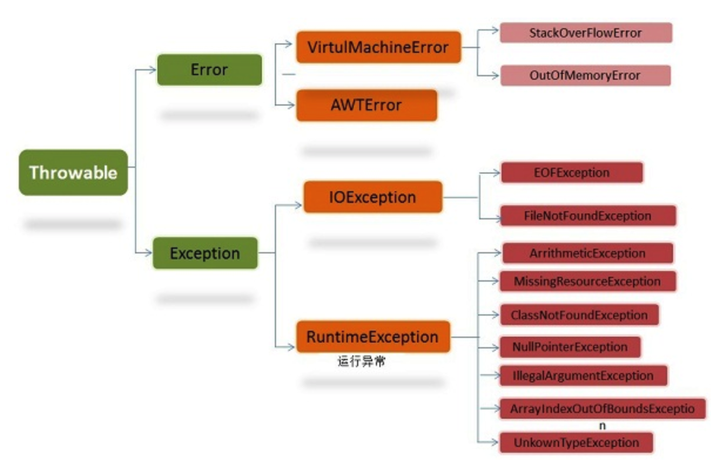

## 1. 面向对象和面向过程的区别

**面向过程**

> 优点： 性能比面向对象高，因为类调用时需要实例化，开销比较大，比较消耗资源;比如单片机、嵌入式开发、Linux/Unix等一般采用面向过程开发，性能是最重要的因素。
>
> 缺点： 没有面向对象易维护、易复用、易扩展

**面向对象**

> 优点： 易维护、易复用、易扩展，由于面向对象有封装、继承、多态性的特性，可以设计出低耦合的系统，使系统更加灵活、更加易于维护
>
> 缺点： 性能比面向过程低

## 2.Java 语言有哪些特点

- 简单易学；
- 面向对象（封装，继承，多态）；
- 平台无关性（ Java 虚拟机实现平台无关性）；
- 可靠性；
- 安全性；
- 支持多线程（ C++ 语言没有内置的多线程机制，因此必须调用操作系统的多线程功能来进行多线程程序设计，而 Java 语言却提供了多线程支持）；
- 支持网络编程并且很方便（ Java 语言诞生本身就是为简化网络编程设计的，因此 Java 语言不仅支持网络编程而且很方便）；
- 编译与解释并存；

## 3. 什么是 JDK 什么是 JRE 什么是 JVM 三者之间的联系与区别

**JDK:** 

> JDK（Java Development Kit）顾名思义它是给开发者提供的开发工具箱,是给程序开发者用的。它除了包括完整的JRE（Java Runtime Environment），Java运行环境，还包含了其他供开发者使用的工具包。

**JRE: **

> 普通用户而只需要安装 JRE（Java Runtime Environment）来运行 Java 程序。而程序开发者必须安装JDK来编译、调试程序。

**JVM：**

> 当我们运行一个程序时，JVM 负责将字节码转换为特定机器代码，JVM 提供了内存管理/垃圾回收和安全机制等。这种独立于硬件和操作系统，正是 java 程序可以一次编写多处执行的原因。

**区别与联系**

> JDK 用于开发，JRE 用于运行java程序 ；
> JDK 和 JRE 中都包含 JVM ；
> JVM 是 java 编程语言的核心并且具有平台独立性。

## 4. 什么是字节码 采用字节码的最大好处是什么

**java 中的编译器和解释器： 　**　

> Java 中引入了虚拟机的概念，即在机器和编译程序之间加入了一层抽象的虚拟的机器。这台虚拟的机器在任何平台上都提供给编译程序一个的共同的接口。

> 编译程序只需要面向虚拟机，生成虚拟机能够理解的代码，然后由解释器来将虚拟机代码转换为特定系统的机器码执行。在 Java 中，这种供虚拟机理解的代码叫做字节码（即扩展名为 .class 的文件），它不面向任何特定的处理器，只面向虚拟机。

> 每一种平台的解释器是不同的，但是实现的虚拟机是相同的。Java 源程序经过编译器编译后变成字节码，字节码由虚拟机解释执行，虚拟机将每一条要执行的字节码送给解释器，解释器将其翻译成特定机器上的机器码，然后在特定的机器上运行。这也就是解释了 Java 的编译与解释并存的特点。

<table><tr><td bgcolor=Chartreuse>Java 源代码---->编译器---->jvm 可执行的 Java 字节码(即虚拟指令)---->jvm---->jvm 中解释器----->机器可执行的二进制机器码---->程序运行。</td></tr></table>

**采用字节码的好处：**　

> Java 语言通过字节码的方式，在一定程度上解决了传统解释型语言执行效率低的问题，同时又保留了解释型语言可移植的特点。所以 Java 程序运行时比较高效，而且，由于字节码并不专对一种特定的机器，因此，Java程序无须重新编译便可在多种不同的计算机上运行。

> 解释型语言：解释型语言，是在运行的时候将程序翻译成机器语言。解释型语言的程序不需要在运行前编译，在运行程序的时候才翻译，专门的解释器负责在每个语句执行的时候解释程序代码。这样解释型语言每执行一次就要翻译一次，效率比较低。

## 5. Java和C++的区别

- 都是面向对象的语言，都支持封装、继承和多态
- Java 不提供指针来直接访问内存，程序内存更加安全
- Java 的类是单继承的，C++ 支持多重继承；虽然 Java 的类不可以多继承，但是接口可以多继承。
- Java 有自动内存管理机制，不需要程序员手动释放无用内存

## 6. 什么是 Java 程序的主类 应用程序和小程序的主类有何不同

> 一个程序中可以有多个类，但只能有一个类是主类。在 Java 应用程序中，这个主类是指包含 main（）方法的类。而在 Java 小程序中，这个主类是一个继承自系统类 JApplet 或 Applet 的子类。应用程序的主类不一定要求是 public 类，但小程序的主类要求必须是 public 类。主类是 Java 程序执行的入口点。

## 7. Java 应用程序与小程序之间有那些差别

> 简单说应用程序是从主线程启动(也就是 main() 方法)。applet 小程序没有main方法，主要是嵌在浏览器页面上运行(调用init()线程或者run()来启动)，嵌入浏览器这点跟 flash 的小游戏类似。

## 8. 字符型常量和字符串常量的区别

- **形式上:** 字符常量是单引号引起的一个字符 字符串常量是双引号引起的若干个字符
- **含义上:** 字符常量相当于一个整形值( ASCII 值),可以参加表达式运算 字符串常量代表一个地址值(该字符串在内存中存放位置)
- **占内存大小** 字符常量只占2个字节 字符串常量占若干个字节(至少一个字符结束标志) （**注意**： char在Java中占两个字节)

## 9. 构造器 Constructor 是否可被 override

> 在讲继承的时候我们就知道父类的私有属性和构造方法并不能被继承，所以 Constructor 也就不能被 override（重写）,但是可以 overload（重载）,所以你可以看到一个类中有多个构造函数的情况。

## 10. 重载和重写的区别

- **重载：** 发生在同一个类中，方法名必须相同，参数类型不同、个数不同、顺序不同，方法返回值和访问修饰符可以不同，发生在编译时。 　　
- **重写：** 发生在父子类中，方法名、参数列表必须相同，返回值范围小于等于父类，抛出的异常范围小于等于父类，访问修饰符范围大于等于父类；如果父类方法访问修饰符为 private 则子类就不能重写该方法。

## 11. Java 面向对象编程三大特性:封装、继承、多态

**封装:**

> 封装把一个对象的属性私有化，同时提供一些可以被外界访问的属性的方法，如果属性不想被外界访问，我们大可不必提供方法给外界访问。但是如果一个类没有提供给外界访问的方法，那么这个类也没有什么意义了。

**继承:**

> 继承是使用已存在的类的定义作为基础建立新类的技术，新类的定义可以增加新的数据或新的功能，也可以用父类的功能，但不能选择性地继承父类。通过使用继承我们能够非常方便地复用以前的代码。

**关于继承如下 3 点记住：**

- 子类拥有父类非 private 的属性和方法。
- 子类可以拥有自己属性和方法，即子类可以对父类进行扩展。
- 子类可以用自己的方式实现父类的方法。

**多态**

> 所谓多态就是指程序中定义的引用变量所指向的具体类型和通过该引用变量发出的方法调用在编程时并不确定，而是在程序运行期间才确定，即一个引用变量倒底会指向哪个类的实例对象，该引用变量发出的方法调用到底是哪个类中实现的方法，必须在由程序运行期间才能决定。
>
> **在Java中有两种形式可以实现多态：继承（多个子类对同一方法的重写）和接口（实现接口并覆盖接口中同一方法）。**

## 12. String 和 StringBuffer、StringBuilder 的区别是什么 String 为什么是不可变的

**可变性** 　

> - 简单的来说：String 类中使用 final 关键字字符数组保存字符串，private　final　char　value[]，所以 String 对象是不可变的。
> - 而StringBuilder 与 StringBuffer 都继承自 AbstractStringBuilder 类，在 AbstractStringBuilder 中也是使用字符数组保存字符串char[]value 但是没有用 final 关键字修饰，所以这两种对象都是可变的。
> - StringBuilder 与 StringBuffer 的构造方法都是调用父类构造方法也就是 AbstractStringBuilder 实现的。

```java
AbstractStringBuilder.java

abstract class AbstractStringBuilder implements Appendable, CharSequence {
    char[] value;
    int count;
    AbstractStringBuilder() {
    }
    AbstractStringBuilder(int capacity) {
        value = new char[capacity];
    }
```

**线程安全性**

> - String 中的对象是不可变的，也就可以理解为常量，线程安全。
> - AbstractStringBuilder 是 StringBuilder 与 StringBuffer 的公共父类，定义了一些字符串的基本操作，如 expandCapacity、append、insert、indexOf 等公共方法。
> - StringBuffer 对方法加了同步锁或者对调用的方法加了同步锁，所以是线程安全的。
> - StringBuilder 并没有对方法进行加同步锁，所以是非线程安全的。 　　

**性能:**

> 每次对 String 类型进行改变的时候，都会生成一个新的 String 对象，然后将指针指向新的 String 对象。StringBuffer 每次都会对 StringBuffer 对象本身进行操作，而不是生成新的对象并改变对象引用。相同情况下使用 StirngBuilder 相比使用 StringBuffer 仅能获得 10%~15% 左右的性能提升，但却要冒多线程不安全的风险。

**对于三者使用的总结：**

- 操作少量的数据 = String
- 单线程操作字符串缓冲区下操作大量数据 = `StringBuilder`
- 多线程操作字符串缓冲区下操作大量数据 = StringBuffer

## 13. 自动装箱与拆箱

> - 装箱：将基本类型用它们对应的引用类型包装起来；

> - 拆箱：将包装类型转换为基本数据类型；

## 14. 在一个静态方法内调用一个非静态成员为什么是非法的

> 由于静态方法可以不通过对象进行调用，因此在静态方法里，不能调用其他非静态变量，也不可以访问非静态变量成员。

## 15. 在 Java 中定义一个不做事且没有参数的构造方法的作用

> Java 程序在执行子类的构造方法之前，如果没有用 super() 来调用父类特定的构造方法，则会调用父类中“没有参数的构造方法”。因此，如果父类中只定义了有参数的构造方法，而在子类的构造方法中又没有用 super() 来调用父类中特定的构造方法，则编译时将发生错误，因为 Java 程序在父类中找不到没有参数的构造方法可供执行。解决办法是在父类里加上一个不做事且没有参数的构造方法。 　

## 16. import java和javax有什么区别

> 刚开始的时候 JavaAPI 所必需的包是 java 开头的包，javax 当时只是扩展 API 包来说使用。
> 然而随着时间的推移，javax 逐渐的扩展成为 Java API 的组成部分。但是，将扩展从 javax 包移动到 java 包将是太麻烦了，最终会破坏一堆现有的代码。因此，最终决定 javax 包将成为标准API的一部分。
> 所以，实际上java和javax没有区别。这都是一个名字。

## 17. 接口和抽象类的区别是什么

> - 接口的方法默认是 public，所有方法在接口中不能有实现(Java 8 开始接口方法可以有默认实现），抽象类可以有非抽象的方法接口中的实例变量默认是 final 类型的，
> - 而抽象类中则不一定一个类可以实现多个接口，但最多只能实现一个抽象类一个类实现接口的话要实现接口的所有方法，而抽象类不一定接口不能用 new 实例化，但可以声明，但是必须引用一个实现该接口的对象 从设计层面来说，抽象是对类的抽象，是一种模板设计，接口是行为的抽象，是一种行为的规范。

## 18. 成员变量与局部变量的区别有那些

> - 从语法形式上，看成员变量是属于类的，而局部变量是在方法中定义的变量或是方法的参数；成员变量可以被 public,private,static 等修饰符所修饰，而局部变量不能被访问控制修饰符及 static 所修饰；但是，成员变量和局部变量都能被 final 所修饰；
> - 从变量在内存中的存储方式来看，成员变量是对象的一部分，而对象存在于堆内存，局部变量存在于栈内存
> - 从变量在内存中的生存时间上看，成员变量是对象的一部分，它随着对象的创建而存在，而局部变量随着方法的调用而自动消失。
>   成员变量如果没有被赋初值，则会自动以类型的默认值而赋值（一种情况例外被 final 修饰的成员变量也必须显示地赋值）；而局部变量则不会自动赋值。

## 19. 创建一个对象用什么运算符？对象实体与对象引用有何不同？

> new运算符，new创建对象实例（对象实例在堆内存中），对象引用指向对象实例（对象引用存放在栈内存中）。
> 一个对象引用可以指向0个或1个对象（一根绳子可以不系气球，也可以系一个气球）;一个对象可以有n个引用指向它（可以用n条绳子系住一个气球）。

## 20. 什么是方法的返回值？返回值在类的方法里的作用是什么？

> 方法的返回值是指我们获取到的某个方法体中的代码执行后产生的结果！（前提是该方法可能产生结果）。返回值的作用:接收出结果，使得它可以用于其他的操作！

## 21. 一个类的构造方法的作用是什么 若一个类没有声明构造方法，该程序能正确执行吗 为什么

> 主要作用是完成对类对象的初始化工作。可以执行。因为一个类即使没有声明构造方法也会有默认的不带参数的构造方法。

## 22. 构造方法有哪些特性

- 名字与类名相同；
- 没有返回值，但不能用void声明构造函数；
- 生成类的对象时自动执行，无需调用。

## 23. 静态方法和实例方法有何不同

> - 在外部调用静态方法时，可以使用"类名.方法名"的方式，也可以使用"对象名.方法名"的方式。而实例方法只有后面这种方式。也就是说，调用静态方法可以无需创建对象。

> - 静态方法在访问本类的成员时，只允许访问静态成员（即静态成员变量和静态方法），而不允许访问实例成员变量和实例方法；实例方法则无此限制.

## 24. 对象的相等与指向他们的引用相等，两者有什么不同？

> 对象的相等，比的是内存中存放的内容是否相等。而引用相等，比较的是他们指向的内存地址是否相等。

## 25. 在调用子类构造方法之前会先调用父类没有参数的构造方法，其目的是？

> 帮助子类做初始化工作。

## 26. == 与 equals(重要)

> == : 它的作用是判断两个对象的地址是不是相等。即，判断两个对象是不是同一个对象。(基本数据类型==比较的是值，引用数据类型==比较的是内存地址)

> equals() : 它的作用也是判断两个对象是否相等。但它一般有两种使用情况：

> - 情况1：类没有覆盖 equals() 方法。则通过 equals() 比较该类的两个对象时，等价于通过“==”比较这两个对象。
> - 情况2：类覆盖了 equals() 方法。一般，我们都覆盖 equals() 方法来两个对象的内容相等；若它们的内容相等，则返回 true (即，认为这两个对象相等)。
>   举个例子：

```java
public class test1 {
    public static void main(String[] args) {
        String a = new String("ab"); // a 为一个引用
        String b = new String("ab"); // b为另一个引用,对象的内容一样
        String aa = "ab"; // 放在常量池中
        String bb = "ab"; // 从常量池中查找
        if (aa == bb) // true
            System.out.println("aa==bb");
        if (a == b) // false，非同一对象
            System.out.println("a==b");
        if (a.equals(b)) // true
            System.out.println("aEQb");
        if (42 == 42.0) { // true
            System.out.println("true");
        }
    }
}
```

**说明：**

> String 中的 equals 方法是被重写过的，因为 object 的 equals 方法是比较的对象的内存地址，而 String 的 equals 方法比较的是对象的值。
> 当创建 String 类型的对象时，虚拟机会在常量池中查找有没有已经存在的值和要创建的值相同的对象，如果有就把它赋给当前引用。如果没有就在常量池中重新创建一个 String 对象。

## 27. hashCode 与 equals（重要）

> 面试官可能会问你：“你重写过 hashcode 和 equals 么，为什么重写equals时必须重写hashCode方法？”

**hashCode（）介绍**

> hashCode() 的作用是获取哈希码，也称为散列码；它实际上是返回一个int整数。这个哈希码的作用是确定该对象在哈希表中的索引位置。hashCode() 定义在JDK的Object.java中，这就意味着Java中的任何类都包含有hashCode() 函数。

> 散列表存储的是键值对(key-value)，它的特点是：能根据“键”快速的检索出对应的“值”。这其中就利用到了散列码！（可以快速找到所需要的对象）

**为什么要有 hashCode**

> 我们以“HashSet 如何检查重复”为例子来说明为什么要有 hashCode：

> 当你把对象加入 HashSet 时，HashSet 会先计算对象的 hashcode 值来判断对象加入的位置，同时也会与其他已经加入的对象的 hashcode 值作比较，如果没有相符的hashcode，HashSet会假设对象没有重复出现。但是如果发现有相同 hashcode 值的对象，这时会调用 equals（）方法来检查 hashcode 相等的对象是否真的相同。如果两者相同，HashSet 就不会让其加入操作成功。如果不同的话，就会重新散列到其他位置。（摘自我的Java启蒙书《Head fist java》第二版）。这样我们就大大减少了 equals 的次数，相应就大大提高了执行速度。

**hashCode（）与equals（）的相关规定**

> 如果两个对象相等，则hashcode一定也是相同的
> 两个对象相等,对两个对象分别调用equals方法都返回true
> 两个对象有相同的hashcode值，它们也不一定是相等的
> 因此，equals 方法被覆盖过，则 hashCode 方法也必须被覆盖
> hashCode() 的默认行为是对堆上的对象产生独特值。如果没有重写 hashCode()，则该 class 的两个对象无论如何都不会相等（即使这两个对象指向相同的数据）

## 28. 为什么Java中只有值传递

https://github.com/Snailclimb/JavaGuide/blob/master/面试必备/最最最常见的Java面试题总结/第一周（2018-8-7）.md

## 29. 简述线程，程序、进程的基本概念。以及他们之间关系是什么

> 线程与进程相似，但线程是一个比进程更小的执行单位。一个进程在其执行的过程中可以产生多个线程。与进程不同的是同类的多个线程共享同一块内存空间和一组系统资源，所以系统在产生一个线程，或是在各个线程之间作切换工作时，负担要比进程小得多，也正因为如此，线程也被称为轻量级进程。

> 程序是含有指令和数据的文件，被存储在磁盘或其他的数据存储设备中，也就是说程序是静态的代码。

> 进程是程序的一次执行过程，是系统运行程序的基本单位，因此进程是动态的。系统运行一个程序即是一个进程从创建，运行到消亡的过程。简单来说，一个进程就是一个执行中的程序，它在计算机中一个指令接着一个指令地执行着，同时，每个进程还占有某些系统资源如CPU时间，内存空间，文件，文件，输入输出设备的使用权等等。换句话说，当程序在执行时，将会被操作系统载入内存中。 线程是进程划分成的更小的运行单位。线程和进程最大的不同在于基本上各进程是独立的，而各线程则不一定，因为同一进程中的线程极有可能会相互影响。从另一角度来说，进程属于操作系统的范畴，主要是同一段时间内，可以同时执行一个以上的程序，而线程则是在同一程序内几乎同时执行一个以上的程序段。

## 30. 线程有哪些基本状态？这些状态是如何定义的?

**新建(new)：**

> 新创建了一个线程对象。

**可运行(runnable)：**

> 线程对象创建后，其他线程(比如main线程）调用了该对象的start()方法。该状态的线程位于可运行线程池中，等待被线程调度选中，获 取cpu的使用权。

**运行(running)：**

> 可运行状态(runnable)的线程获得了cpu时间片（timeslice），执行程序代码。

**阻塞(block)：**

> 阻塞状态是指线程因为某种原因放弃了cpu使用权，也即让出了cpu timeslice，暂时停止运行。直到线程进入可运行(runnable)状态，才有 机会再次获得cpu timeslice转到运行(running)状态。
> **阻塞的情况分三种：** 
>
> - (一). 等待阻塞：运行(running)的线程执行o.wait()方法，JVM会把该线程放 入等待队列(waitting queue)中。
> - (二). 同步阻塞：运行(running)的线程在获取对象的同步锁时，若该同步锁 被别的线程占用，则JVM会把该线程放入锁池(lock pool)中。
> - (三). 其他阻塞: 运行(running)的线程执行Thread.sleep(long ms)或t.join()方法，或者发出了I/O请求时，JVM会把该线程置为阻塞状态。当sleep()状态超时join()等待线程终止或者超时、或者I/O处理完毕时，线程重新转入可运行(runnable)状态。

**死亡(dead)：**

> 线程run()、main()方法执行结束，或者因异常退出了run()方法，则该线程结束生命周期。死亡的线程不可再次复生。




备注： 可以用早起坐地铁来比喻这个过程：

```
还没起床：sleeping

起床收拾好了，随时可以坐地铁出发：Runnable

等地铁来：Waiting

地铁来了，但要排队上地铁：I/O阻塞

上了地铁，发现暂时没座位：synchronized阻塞

地铁上找到座位：Running

到达目的地：Dead
```

## 31 关于 final 关键字的一些总结finally、finalize

**final关键字主要用在三个地方：变量、方法、类。**

> 对于一个final变量，如果是基本数据类型的变量，则其数值一旦在初始化之后便不能更改；如果是引用类型的变量，则在对其初始化之后便不能再让其指向另一个对象。
> 当用final修饰一个类时，表明这个类不能被继承。final类中的所有成员方法都会被隐式地指定为final方法。
> 使用final方法的原因有两个。第一个原因是把方法锁定，以防任何继承类修改它的含义；第二个原因是效率。在早期的Java实现版本中，会将final方法转为内嵌调用。但是如果方法过于庞大，可能看不到内嵌调用带来的任何性能提升（现在的Java版本已经不需要使用final方法进行这些优化了）。类中所有的private方法都隐式地指定为final。

**区别**

> - 被final修饰的类，就意味着不能再派生出新的子类，不能作为父类而被子类继承。因此一个类不能既被abstract声明，又被final声明。将变量或方法声明为final，可以保证他们在使用的过程中不被修改。被声明为final的变量必须在声明时给出变量的初始值，而在以后的引用中只能读取。被final声明的方法也同样只能使用，
>   即不能方法重写。
> - finally是在异常处理时提供finally块来执行任何清除操作。不管有没有异常被抛出、捕获，finally块都会被执行。try块中的内容是在无异常时执行到结束。catch块中的内容，是在try块内容发生catch所声明的异常时，跳转到catch块中执行。finally块则是无论异常是否发生，都会执行finally块的内容，所以在代码逻辑中有需要无论发生什么都必须执行的代码，就可以放在finally块中。

> - finalize是方法名。java技术允许使用finalize（）方法在垃圾收集器将对象从内存中清除出去之前做必要的清理工作。这个方法是由垃圾收集器在确定这个对象没有被引用时对这个对象调用的。它是在object类中定义的，因此所有的类都继承了它。子类覆盖finalize（）方法以整理系统资源或者被执行其他清理工作。finalize（）方法是在垃圾收集器删除对象之前对这个对象调用的。 

## 32.Overload和Override的区别。

> 首先重载和重写是应用于两个不同场景下面的两种不同的手段：

** 两者各自的特征：**
 **重载（Overload）:**

> 首先是位于一个类之中或者其子类中，具有相同的方法名，但是方法的参数不同，返回值类型可以相同也可以不同。
> （1）：方法名必须相同
> （2）：方法的参数列表一定不一样。
> （3）：访问修饰符和返回值类型可以相同也可以不同。
> 其实简单而言：重载就是对于不同的情况写不同的方法. 比如，同一个类中，写不同的构造函数用于初始化不同的参数。

**重写（override）：**

> 一般都是表示子类和父类之间的关系，其主要的特征是：
> 方法名相同，
> 参数相同，
> 但是具体的实现不同。

**重写的特征：**

> （1）：方法名必须相同，返回值类型必须相同
> （2）：参数列表必须相同
> （3）：访问权限不能比父类中被重写的方法的访问权限更低。例如：如果父类的一个方法被声明为public，那么在子类中重写该方法就不能声明为protected。
> （4）：子类和父类在同一个包中，那么子类可以重写父类所有方法，除了声明为private和final的方法。
> （5）：构造方法不能被重写，简单而言：就是具体的实现类对于父类的该方法实现不满意，需要自己在写一个满足于自己要求的方法。

## 33 Java 中的异常处理

**Java异常类层次结构图**




> Java异常类层次结构图 在 Java 中，所有的异常都有一个共同的祖先java.lang包中的 Throwable类。Throwable： 有两个重要的子类：Exception（异常） 和 Error（错误） ，二者都是 Java 异常处理的重要子类，各自都包含大量子类。

**Error（错误）:**

> 是程序无法处理的错误，表示运行应用程序中较严重问题。大多数错误与代码编写者执行的操作无关，而表示代码运行时 JVM（Java 虚拟机）出现的问题。例如，Java虚拟机运行错误（Virtual MachineError），当 JVM 不再有继续执行操作所需的内存资源时，将出现 OutOfMemoryError。这些异常发生时，Java虚拟机（JVM）一般会选择线程终止。

> 这些错误表示故障发生于虚拟机自身、或者发生在虚拟机试图执行应用时，如Java虚拟机运行错误（Virtual MachineError）、类定义错误（NoClassDefFoundError）等。这些错误是不可查的，因为它们在应用程序的控制和处理能力之 外，而且绝大多数是程序运行时不允许出现的状况。对于设计合理的应用程序来说，即使确实发生了错误，本质上也不应该试图去处理它所引起的异常状况。在 Java中，错误通过Error的子类描述。

**Exception（异常）:**

> 是程序本身可以处理的异常。Exception 类有一个重要的子类 RuntimeException。RuntimeException 异常由Java虚拟机抛出。NullPointerException（要访问的变量没有引用任何对象时，抛出该异常）、ArithmeticException（算术运算异常，一个整数除以0时，抛出该异常）和 ArrayIndexOutOfBoundsException （下标越界异常）。

**注意：**

> 异常和错误的区别：异常能被程序本身可以处理，错误是无法处理。

**Throwable类常用方法**

> public string getMessage():返回异常发生时的详细信息
> public string toString():返回异常发生时的简要描述
> public string getLocalizedMessage():返回异常对象的本地化信息。使用Throwable的子类覆盖这个方法，可以声称本地化信息。如果子类没有覆盖该方法，则该方法返回的信息与getMessage（）返回的结果相同
> public void printStackTrace():在控制台上打印Throwable对象封装的异常信息

**异常处理总结**

> try 块：用于捕获异常。其后可接零个或多个catch块，如果没有catch块，则必须跟一个finally块。
> catch 块：用于处理try捕获到的异常。
> finally 块：无论是否捕获或处理异常，finally块里的语句都会被执行。当在try块或catch块中遇到return语句时，finally语句块将在方法返回之前被执行。
> 在以下4种特殊情况下，finally块不会被执行：

> 在finally语句块中发生了异常。
> 在前面的代码中用了System.exit()退出程序。
> 程序所在的线程死亡。
> 关闭CPU。

## 34 Java序列话中如果有些字段不想进行序列化 怎么办

> 对于不想进行序列化的变量，使用transient关键字修饰。

**transient关键字的作用是：**

> 阻止实例中那些用此关键字修饰的的变量序列化；当对象被反序列化时，被transient修饰的变量值不会被持久化和恢复。transient只能修饰变量，不能修饰类和方法。

## 34 获取用键盘输入常用的的两种方法

**方法1：**
    通过 Scanner

```java
Scanner input = new Scanner(System.in);
String s  = input.nextLine();
input.close();
```

**方法2：**
    通过 BufferedReader

```java
BufferedReader input = new BufferedReader(new InputStreamReader(System.in)); 
String s = input.readLine(); 
```

## 35八种基础数据类型及字节大小

```java
1. byte               8位

2. short                16位

3. int                  32位

4. long                 64位

5. float                32位

6. double               64位

7. boolean               1位

8. char                 16位
```

## 36.说说&和&&的区别以及|和||区别？

> - &和&&都是逻辑运算符，都是判断两边同时真则为真，否则为假；但是&&当第一个条件不成之后，后面的条件都不执行了，而&则还是继续执行，直到整个条件语句执行完为止。
> - |也是位运算符。| 表示两边都会运算，然后再判断结果；|| 表示先运算符号左边的东西，然后判断是否为true，是true就停下来直接输出不会再运行后面的东西，是false就继续运算右边的然后判断并输出。

**举例：**

```
System.out.println(3|9);
解析：
3 | 9=0011（二进制） | 1001（二进制）=1011（二进制）=11（十进制）
```

## 37.short s1 = 1; s1 = s1 + 1;有什么错? short s1 = 1; s1 += 1;有什么错?

```
short s1 = 1; s1 = s1 + 1; s1+1
运算结果是int型，需要强制转换类型； 
short s1 = 1; s1 += 1;
可以正确编译,自动类型提升。
```

## 8.int 和 Integer 有什么区别?

> Java 提供两种不同的类型：引用类型和原始类型（或内置类型）；
> int是java的原始数据类型，
> Integer是java为int提供的封装类。 
> 引用类型和原始类型的行为完全不同，并且它们具有不同的语义。引用类型和原始类型具有不同的特征和用法，

> 它们包括：大小和速度问题，这种类型以哪种类型的数据结构存储，

> 当引用类型和原始类型用作某个类的实例数据时所指定的缺省值。

> 对象引用实例变量的缺省值为 null，而原始类型实例变量的缺省值与它们的类型有关。

## 39.在JAVA中，如何跳出当前的多重嵌套循环？

> 在最外层循环前加label标识,然后用break:label方法即可跳出多重循环。

```java
ok:while(true){
    while(true){
        break ok;
    }
}
```

## 40.使用嵌套的for循环打印九九乘法表。

```java
public class test {
    public static void main(String[] args) {
        for (int i = 1; i <= 9; i++) {
            for (int j = 1; j <= i; j++) {
                System.out.print(j + "*" + i + "=" + i * j + " ");
            }
            System.out.println();
        }
    }
}
```

## 41、面向对象的特征有哪些方面

**1.抽象：**

> 抽象就是忽略一个主题中与当前目标无关的那些方面，以便更充分地注意与当前目标有关的方面。抽象并不打算了解全部问题，而只是选择其中的一部分，暂时不用部分细节。抽象包括两个方面，一是过程抽象，二是数据抽象。

**2.继承：**

> 继承是一种联结类的层次模型，并且允许和鼓励类的重用，它提供了一种明确表述共性的方法。对象的一个新类可以从现有的类中派生，这个过程称为类继承。新类继承了原始类的特性，新类称为原始类的派生类（子类），而原始类称为新类的基类（父类）。派生类可以从它的基类那里继承方法和实例变量，并且类可以修改或增加新的方法使之更适合特殊的需要。

**3.封装：**

> 封装是把过程和数据包围起来，对数据的访问只能通过已定义的界面。面向对象计算始于这个基本概念，即现实世界可以被描绘成一系列完全自治、封装的对象，这些对象通过一个受保护的接口访问其他对象。

**4. 多态性：**

> 多态性是指允许不同类的对象对同一消息作出响应。多态性包括参数化多态性和包含多态性。多态性语言具有灵活、抽象、行为共享、代码共享的优势，很好的解决了应用程序函数同名问题。

## 42.java 创建对象的几种方式

> - 采用new

> - 通过反射

> - 采用clone

> - 通过序列化机制

> 前2者都需要显式地调用构造方法。造成耦合性最高的恰好是第一种，因此你发现无论什么框架，只要涉及到解耦必先减少new的使用。

## 43.String s = new String("xyz");创建了几个String Object

> 两个，一个字符对象，一个字符对象引用对象

## 44.Math.round(11.5)等於多少? Math.round(-11.5)等於多少?

> Math.round(11.5)==12;
> Math.round(-11.5)==-11;
> round方法返回与参数最接近的长整数，参数加1/2后求其floor

## 45.Overload和Override的区别。Overloaded的方法是否可以改变返回值的类型

> 方法的重写Overriding和重载Overloading是Java多态性的不同表现。
> 重写Overriding是父类与子类之间多态性的一种表现，重载Overloading是一个类中多态性的一种表现。
> 如果在子类中定义某方法与其父类有相同的名称和参数，我们说该方法被重写 (Overriding)。子类的对象使用这个方法时，
> 将调用子类中的定义，对它而言，父类中的定义如同被"屏蔽"了。
> 如果在一个类中定义了多个同名的方法，它们或有不同的参数个数或有不同的参数类型，
> 则称为方法的重载(Overloading)。Overloaded的方法是可以改变返回值的类型

## 46.abstract class和interface有什么区别

| 类型       |                        abstract class                        | Interface                                                    |
| ---------- | :----------------------------------------------------------: | ------------------------------------------------------------ |
| 定义       |                     abstract class关键字                     | Interface关键字                                              |
| 继承       | 抽象类可以继承一个类和实现多个接口；<br>子类只可以继承一个抽象类 | 接口只可以继承接口（一个或多个）；<br>子类可以实现多个接口   |
| 访问修饰符 |    抽象方法可以有public、protected和<br>default这些修饰符    | 接口方法默认修饰符是public。<br>你不可以使用其它修饰符       |
| 方法实现   |         可定义构造方法，<br>可以有抽象方法和具体方法         | 接口完全是抽象的，没构造方法，<br>且方法都是抽象的，不存在方法的实现 |
| 实现方式   | 子类使用extends关键字来继承抽象类。<br>如果子类不是抽象类的话，它需要提供抽象类中所有声明的方法的实现 | 子类使用关键字implements来实现接口。<br>它需要提供接口中所有声明的方法的实现 |

|作用|为了把相同的东西提取出来,即**重用**|为了把程序模块进行固化的契约,是为了**降低偶合**

## 47. GC是什么? 为什么要有GC?

> GC是垃圾收集的意思，内存处理是编程人员容易出现问题的地方，忘记或者错误的内存回收会导致程序或系统的不稳定甚至崩溃，Java提供的GC功能可以自动监测对象是否超过作用域从而达到自动回收内存的目的，

> Java语言没有提供释放已分配内存的显示操作方法。Java程序员不用担心内存管理，因为垃圾收集器会自动进行管理。要请求垃圾收集，
> 可以调用下面的方法之一：
> System.gc()或Runtime.getRuntime().gc()，
> 但JVM可以屏蔽掉显示的垃圾回收调用。 

> 垃圾回收可以有效的防止内存泄露，有效的使用可以使用的内存。垃圾回收器通常是作为一个单独的低优先级的线程运行，不可预知的情况下对内存堆中已经死亡的或者长时间没有使用的对象进行清除和回收，程序员不能实时的调用垃圾回收器对某个对象或所有对象进行垃圾回收。

> Java有了GC，
> 就不需要程序员去人工释放内存空间。当Java虚拟机发觉内存资源紧张的时候，
> 就会自动地去清理无用变量所占用的内存空间。当然，如果需要，程序员可以在Java程序中显式地使用System.gc()来强制进行一次立即的内存清理。

## 48. 构造器如何工作？

 **Java在构造实例时的顺序是这样的：**

- 1、分配对象空间，并将对象中成员初始化为0或者空，java不允许用户操纵一个不定值的对象。 　　
- 2、执行属性值的显式初始化 　　
- 3、执行构造器 　　
- 4 、将变量关联到堆中的对象上

**执行构造器的步骤有可以分为以下几步：**

- 1、Bind构造器的参数
- 2、如果显式的调用了this，那就递归调用this构造器然后跳到步骤5
- 3、递归调用显式或者隐式的父类构造器，除了Object以外，因为它没有父类
- 4、执行显式的实例变量初始化（也就是上边的流程中的第二步，调用返回以后执行，
  这个步骤相当于在父构造器执行后隐含执行的，看样子像一个特殊处理）

## 49. 构造器Constructor是否可被override?

> 构造器Constructor不能被继承，因此不能重写Overriding，但可以被重载Overloading 

- 1). 构造器不能是native,final,static,synchronized 的,可以是public,private,或什么都没有。 
- 2). 构造器函数里可以写return呢,但后面什么都不许有(包括null) 
- 3). 构造器不能返回值. 但如果有个"构造器"返值了,它就不是构造器喽,只是个普通方法 
- 4). super();this();这两个方法只能在构造方法里调用. 
- 5). 成员变量声明时候赋值,比构造函数还早.

## 50. 写一个Singleton出来。

> Singleton模式主要作用是保证在Java应用程序中，一个类Class只有一个实例存在。 一般Singleton模式通常有几种种形式:

 **第一种形式: **

> 定义一个类，它的构造函数为private的，它有一个static的private的该类变量，在类初始化时实例话，通过一个public的getInstance方法获取对它的引用,继而调用其中的方法。

```java
 // 饿汉式
public class Singleton { 
　　private Singleton(){} 
　　//在自己内部定义自己一个实例，是不是很奇怪？ 
　　//注意这是private 只供内部调用 
　　private static Singleton instance = new Singleton(); 
　　//这里提供了一个供外部访问本class的静态方法，可以直接访问　　 
　　public static Singleton getInstance() { 
　　　　return instance; 　　 
　　 } 
} 
```

**第二种形式: **

```java
// 懒汉式，可能存在线程安全问题
public class Singleton { 
　　private static Singleton instance = null; 
　　public static synchronized Singleton getInstance() { 
　　//这个方法比上面有所改进，不用每次都进行生成对象，只是第一次　　　 　 
　　//使用时生成实例，提高了效率！ 
　　if (instance==null) 
　　　　instance＝new Singleton(); 
return instance; 　　} 
} 
```

**其他形式:** 

> 定义一个类，它的构造函数为private的，所有方法为static的。 一般认为第一种形式要更加安全些

## 51.Java 中的异常处理机制的简单原理和应用？

一、Execption可以分为**java标准定义的异常**和**程序员自定义异常**2种

- 1.一种是当程序违反了java语规则的时候,JAVA虚拟机就会将发生的错误表示为一个异常.这里语法规则指的是JAVA类库内置的语义检查。例如 `int i = 2 / 0 `或者 `String str = null;str.length();`
- 2.另一种情况就是JAVA允许程序员扩展这种语义检查，程序员可以创建自己的异常，并自由选择在何时用throw关键字引发异常。例如 `Exception ex = new Exception("这是我自定义的异常;
  throw ex;`

> 所有的异常都是Thowable的子类。异常处理是与程序执行是并行的。

**二、异常的处理方式**
    1.捕获异常
    

```java
 try {
  int i = 2 / 0;
 } catch (Exception ex) {
   ex.printStackTrace();
   System.out.println("异常信息：" + ex.getMessage());
}

2.上抛异常 throws
public void test() throws Exception { 
    String str = null;
    str.length();
}
```

## 52.运行时异常与一般异常有何异同？

**(1)运行时异常**

> 都是RuntimeException类及其子类异常，如NullPointerException、IndexOutOfBoundsException等，这些异常是不检查异常，程序中可以选择捕获处理，也可以不处理。这些异常一般是由程序逻辑错误引起的，程序应该从逻辑角度尽可能避免这类异常的发生。
> 当出现RuntimeException的时候，我们可以不处理。当出现这样的异常时，总是由虚拟机接管。比如：我们从来没有人去处理过NullPointerException异常，它就是运行时异常，并且这种异常还是最常见的异常之一。
> 出现运行时异常后，系统会把异常一直往上层抛，一直遇到处理代码。如果没有处理块，到最上层，如果是多线程就由Thread.run()抛出，如果是单线程就被main()抛出。抛出之后，如果是线程，这个线程也就退出了。如果是主程序抛出的异常，那么这整个程序也就退出了。运行时异常是Exception的子类，也有一般异常的特点，是可以被Catch块处理的。只不过往往我们不对他处理罢了。也就是说，你如果不对运行时异常进行处理，那么出现运行时异常之后，要么是线程中止，要么是主程序终止。 
> 如果不想终止，则必须扑捉所有的运行时异常，决不让这个处理线程退出。队列里面出现异常数据了，正常的处理应该是把异常数据舍弃，然后记录日志。不应该由于异常数据
> 而影响下面对正常数据的处理。

**(2)非运行时异常**

> 是RuntimeException以外的异常，类型上都属于Exception类及其子类。如 IOException、SQLException 等以及用户自定义的Exception异常。对于这种异常，JAVA编译器强制要求我们必需对出现的这些异常进行catch并处理，否则程序就不能编译通过。所以，面对这种异常不管我们是否愿意，只能自己去写一大堆catch块去处理可能的异常。

## 53.comparable 和 comparator的不同之处？

**Comparable**

> Comparable可以认为是一个内比较器，实现了Comparable接口的类有一个特点，就是这些类是可以和自己比较的，至于具体和另一个实现了Comparable接口的类如何比较，则依赖compareTo方法的实现，compareTo方法也被称为自然比较方法。
> 如果开发者add进入一个Collection的对象想要Collections的sort方法帮你自动进行排序的话，那么这个对象必须实现Comparable接口。compareTo方法的返回值是int，
> 有三种情况：
>
> - 1、比较者大于被比较者（也就是compareTo方法里面的对象），那么返回正整数
> - 2、比较者等于被比较者，那么返回0
> - 3、比较者小于被比较者，那么返回负整数

**Comparator**

> 可以认为是是一个外比较器，个人认为有两种情况可以使用实现Comparator接口的方式：
>
> - 1、一个对象不支持自己和自己比较（没有实现Comparable接口），但是又想对两个对象进行比较
> - 2、一个对象实现了Comparable接口，但是开发者认为compareTo方法中的比较方式并不是自己想要的那种比较方式

> Comparator接口里面有一个compare方法，方法有两个参数T o1和T o2，是泛型的表示方式，分别表示待比较的两个对象，方法返回值和Comparable接口一样是int，
> 有三种情况：
>
> - 1、o1大于o2，返回正整数
> - 2、o1等于o2，返回0
> - 3、o1小于o2，返回负整数

**总结** 

> 两种比较器Comparable和Comparator，后者相比前者有如下优点：
>
> 1、如果实现类没有实现Comparable接口，又想对两个类进行比较或者实现类实现了Comparable接口，但是对compareTo方法内的比较算法不满意，那么可以实现Comparator接口，自定义一个比较器，写比较算法
>
> 2、实现Comparable接口的方式比实现Comparator接口的耦合性要强一些，如果要修改比较算法，要修改Comparable接口的实现类，而实现Comparator的类是在外进行比较的，不需要对实现类有任何修 改。从这个角度说，其实有些不太好，尤其在我们将实现类的.class文件打成一个.jar文件提供给开发者使用的时候。实际上实现Comparator 接口的方式后面会写到就是一种典型的策略模式。
> 当然，这不是鼓励用Comparator，意思是开发者还是要在具体场景下选择最合适的那种比较器而已

## 54.Iterator、ListIterator 和 Enumeration的区别？

> 迭代器是一种设计模式，它是一个对象，它可以遍历并选择序列中的对象，而开发人员不需要了解该序列的底层结构。迭代器通常被称为“轻量级”对象，因为创建它的代价小。
> Java中的Iterator功能比较简单，并且只能单向移动：
>
> - (1) 使用方法iterator()要求容器返回一个Iterator。第一次调用Iterator的next()方法时，它返回序列的第一个元素。<font color="red">注意</font>：iterator()方法是java.lang.Iterable接口被Collection继承。
> - (2) 使用next()获得序列中的下一个元素。
> - (3) 使用hasNext()检查序列中是否还有元素。
> - (4) 使用remove()将迭代器新返回的元素删除。Iterator是Java迭代器最简单的实现，为List设计的ListIterator具有更多的功能，它可以从两个方向遍历List，也可以从List中插入和删除元素。

**ListIterator的特点:**

> 它的父类接口是`Iterator`，名称是系列表迭代器，允许程序员按任一方向遍历列表、
> 迭代期间修改列表，并获得迭代器在列表中的当前位置。`ListIterator`没有当前元素，
> 它的光标位置始终位于调用`previous()`所返回的元素和调用`next()`所返回的元素之间。长度为n的列表的迭代器有n+1个可能的指针位置。

------

**Enumeration的特点:**

> API中是这样描述的,它主要是和Vector结合配套使用。另外此接口的功能与Iterator接口的功能是重复的，此外,Iterator接口添加了一个可选的移除操作，并且使用较短的方法名。新的实现应该优先考虑使用Iterator接口而不是Enumeration接口。

 **总结**

> java中的集合类都提供了返回Iterator的方法，就是迭代器，它和Enumeration的主要区别其实就是Iterator可以删除元素，但是Enumration却不能。

